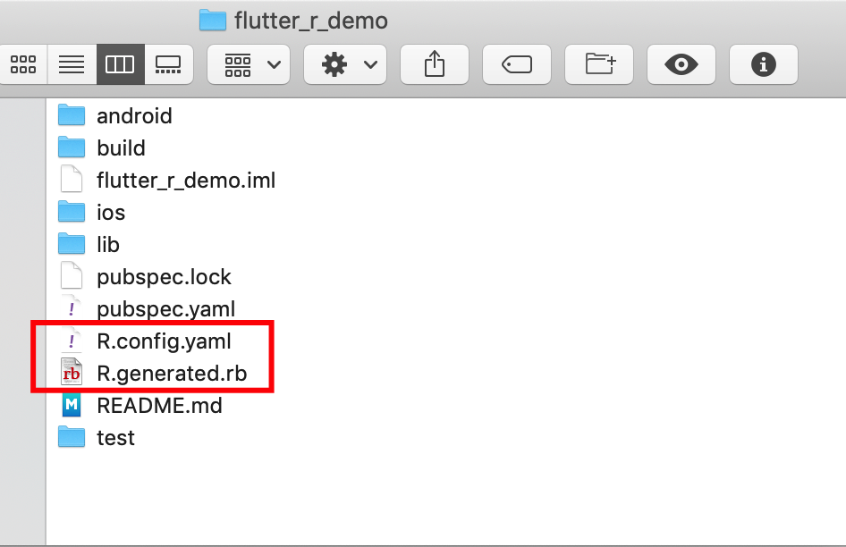
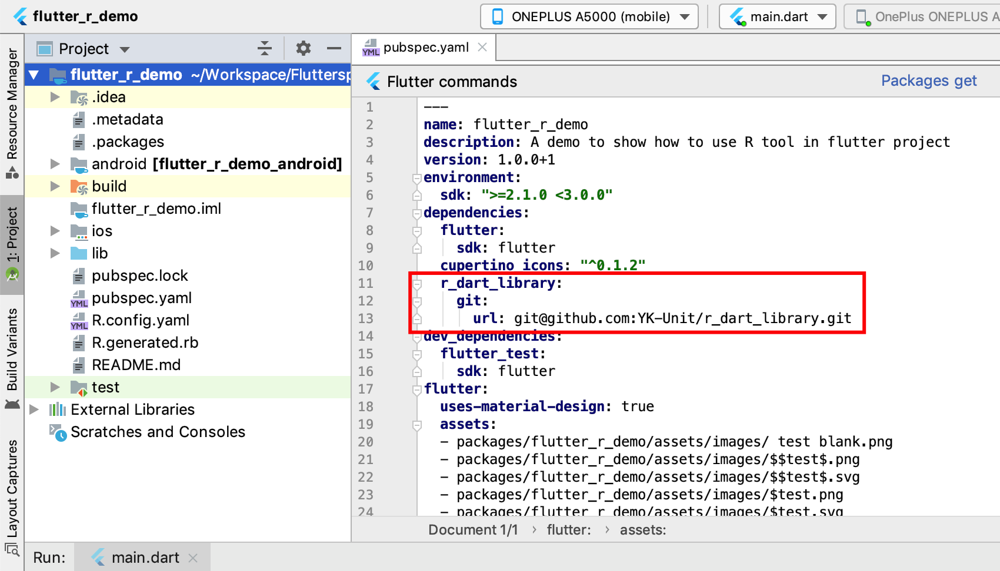
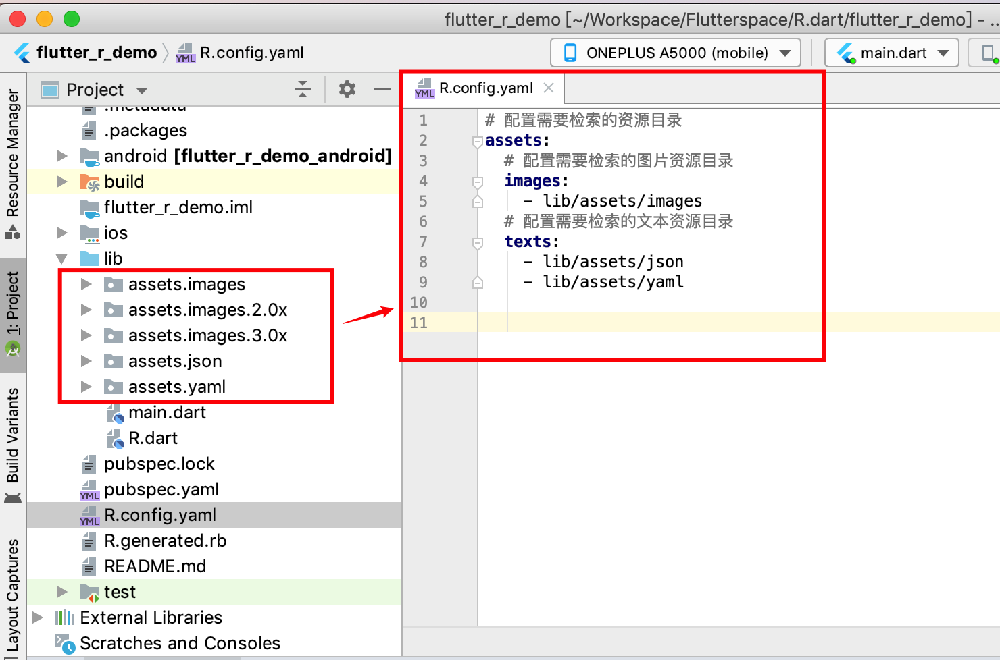
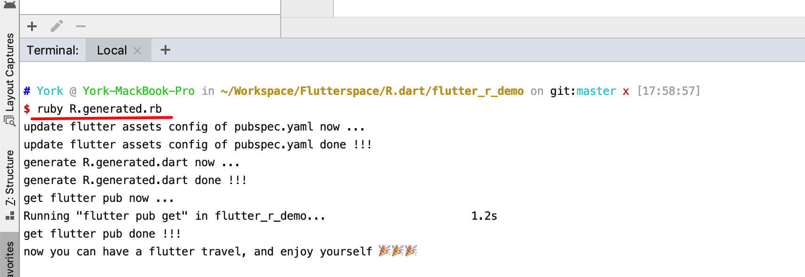

# About R.dart
`R.dart`项目旨在为Flutter开发者提供类似Android下的R方案的体验：其提供了一个脚本工具`R.generated.rb`，使Flutter开发者运行一个命令即可自动检索指定的APP资源目录，并对检索的APP资源进行代码外部化（ externalize app resources with code），最后生成`R`类（对应`R.dart`文件）供开发者通过资源ID来应用资源。

# `R.generated.rb` feature

- 支持配置检索的目录
- 支持图片资源（`.png`、 `.jpg`、 `.jpeg`、 `.gif`、 `.webp`、 `.icon`、 `.bmp`、 `.wbmp`、`.svg`）和文本资源（`.txt`、`.json`、`.yaml`、`.xml`）的检索和外部化
- 支持变体（variant）图片资源的外部化
- 支持名称首字符为数字的资源的外部化
- 支持名称含有特殊字符（如`~`、`!`、`@`、`#`、`$`等）的资源的外部化
- 支持类型不同但名称相同的资源的外部化

# How to use `R.generated.rb`

下面将会通过示例工程 [flutter_r_demo](https://github.com/YK-Unit/R.dart/tree/master/flutter_r_demo) 演示如何使用`R.generated.rb`工具：

1. 拷贝`R.generated.rb`和`R.config.yaml`到你的Flutter项目根目录：

   

2. 添加依赖包 [r_dart_Library](https://github.com/YK-Unit/r_dart_Library) 到你的Flutter项目中：

   

   

   PS：由于还没有发布依赖包`r_dart_Library`到[pub.dev](https://pub.flutter-io.cn/)，故当前通过git的方式添加。

3. 根据你的Flutter项目资源放置情况，配置`R.config.yaml`：

   

4. 在你的Flutter项目根目录执行命令：`ruby R.generated.rb`

   

5. 若更新了（增删改）APP资源，则再次执行步骤4即可~

# TODO

1. 为脚本工具增加版本检测功能
2. 支持更多类型资源的检测和外部化